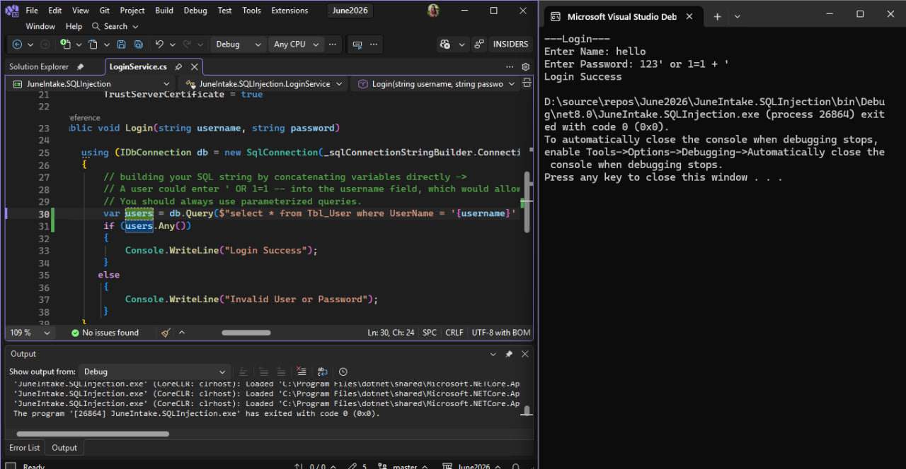

# June2026

## SQL Injection Demonstration

This project demonstrates how SQL injection vulnerabilities occur when using string concatenation in SQL queries.



### Vulnerability Explained
As shown in the screenshot, the application is susceptible to SQL injection because it concatenates user input directly into the query string:

```csharp
var users = db.Query($"select * from Tbl_User where UserName = '{username}'");